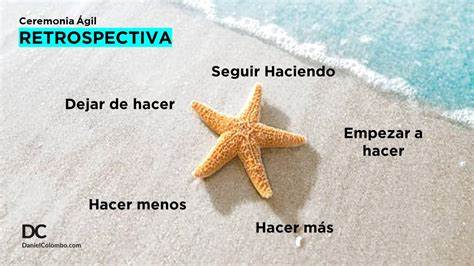

# Punto Coleccion
* Proyecto e-commerce (Retrospectiva de primer sprint)

# Fecha de reunion:
 * Domingo 05/11/2023
    10:35am

# Integrantes:
    * Castillo, Valeria.
    * Escobar, Paula.
    * Figoli, Nazareno.
    * Testa, Lucio.

# Reseña:
Se comenxo la reunion con todos los integrantes via meet,(videollamada), implementando le dinamica estrella de mar cada integrante fue esponiendo y su opinion respecto a estos 5 ejes, y llegamos a las siguientes conclusiones:

1.Comenzar Hacer:
    * Definir tareas cocretas,
    * Implimentacion de Daylis cortas, por  motivos de horarios las realizaremos via whatsApp , e inteentar realizar algunas por meet cuando fuere posible u/o necesario.
    * Mantener nuestro repositorio actualizado e informar los cambios a los demas integrantes.
    * Nos hemos comprometido en ayudar  si algun intengrante solicita ayuda u se encuentra bloqueado en algun punto del trabajo.
    * Respetar el tiempo de cada uno.
    * Cumplir con las fechas Pactadar(responsabilidad y compromiso)

2.Hacermas:
    *Daylis mostrando el avanse dia a dia.
    *Mejorar la comunicacion.
    *Optimizar el tiempo de trabajo para sacar el mejor redito de cada uno.
    *Mantenernos enfocados.
    *Organizarnos de manera correcta las tereas y el tiempo.

3.Hacer menos:
    *No relizaremos reuniones extensas.
    *No discutir.
    *Se acordo la tematica hablar menos y hacer mas.
        
4.Dejar de hacer:
    *Dejar fuera las discuciones o temas que no esten dentro del tema del trabajo.Punto Coleccion
Proyecto e-commerce (Retrospectiva de primer sprint)
Fecha de reunion:
Domingo 05/11/2023
10:35am
Integrantes:
* Castillo, Valeria.
* Escobar, Paula.
* Figoli, Nazareno.
* Testa, Lucio.
Reseña:
Se comezo la reunion con todos los integrantes via meet,(videollamada), implementando le dinamica estrella de mar cada integrante fue esponiendo y su opinion respecto a estos 5 ejes, y llegamos a las siguientes conclusiones:

1.Comenzar Hacer:
* Definir tareas cocretas,
* Implimentacion de Daylis cortas, por motivos de horarios las realizaremos via whatsApp , e inteentar realizar algunas por meet cuando fuere posible u/o necesario.
* Mantener nuestro repositorio actualizado e informar los cambios a los demas integrantes.
* Nos hemos comprometido en ayudar si algun intengrante solicita ayuda u se encuentra bloqueado en algun punto del trabajo.
* Respetar el tiempo de cada uno.
* Cumplir con las fechas Pactadar(responsabilidad y compromiso)

2.Hacermas:
*Daylis mostrando el avanse dia a dia.
*Mejorar la comunicacion.
*Optimizar el tiempo de trabajo para sacar el mejor redito de cada uno.
*Mantenernos enfocados.
*Organizarnos de manera correcta las tereas y el tiempo.

3.Hacer menos:
*No relizaremos reuniones extensas.
*No discutir.
*Se acordo la tematica hablar menos y hacer mas.

4.Dejar de hacer:
*Dejar fuera las discuciones o temas que no esten dentro del tema del trabajo.

#Retrospectiva Sprint 2

#Breve reseña:
El día Miércoles  6/12/2023 a las 19:17 aproximadamente
Realizamos una retrospectiva vía zoom.
Estando todos los integrantes presentes y el Prof. Martin( habilidades Blandas)
En la que teniendo como guía la retrospectiva anterior hablamos sobre los puntos que 
establece la metodología estrella de mar que venimos trabajando.
Ante el cuestionamiento;  de que puntos de este son los más destacables y en cuales 
necesitamos trabajar más.
 # Surgieron los siguientes conclusiones:

1. Comenzar a hacer: Buscar la forma de tener mejor comunicación, encontrar la 
forma para que el trabajo en equipo sea más fluido y lo menos tensionado 
posible. Respetar los puntos pactados en el sprint anterior e implementarlos en los siguientes.
	
2. Hacer más: Trabajar enfocados, centrados y poder    decidir y distribuir las 
tareas más dinámicamente para optimizar el tiempo. Comunicarnos de la mejor 
manera posible y con claridad para no generar confusiones o incomodidad en los 
demás. Implementar mas Daylis. En caso de que haya malos entendidos, resolverlo de forma civilizada escuchando y respetando a la otra persona.
	
3. Hacer menos:Entrar en dialogos que no aportan al proyecto.

	
4. Dejar de Hacer: faltarnos el respeto, u hacer comentarios que pueden herir a otros.

	
5. Seguir Haciendo: Continuar trabajando como hasta ahora en lo que refiere a los puntos del trabajo y resolución de incidencias.
